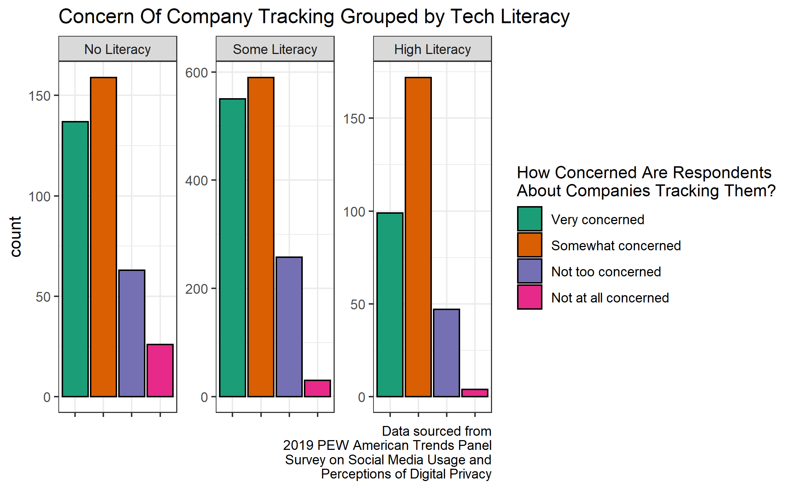

# Investigation of Privacy Issues In The 2019 PEW Survey on American Trends on Technology Dataset
### What Is This?

This repo contains a slightly modified version of my final project for a Sociology and Anthropology course on Data Visualization. For the final project my partner, Adriana Knight, and I investigated questions related to  to digital rights and data privacy. We used the 2019 PEW Survey on American Trends on Technology dataset which is not available in this repo. All of our findings are reproducible with the R code found in this repo -- provided you get your own copy of the PEW dataset. Jump to the [Repo Structure Section](#repo-structure) to learn more. 

### Main Findings

Below are our key findings from the project. The `Submission.pdf` goes into detail about how the graphs were created and what their ramifications are. 

#### Key Figure 1: Attitudes on How Many Categories of Data Should Be Protected by "The Right To Be Forgotten\" Split by Stance on Personal Data Use


The caption of the image states: "How many of the following categories fall under the Right to Be Forgotten? 

* Data collected by law enforcement   
* Employment history or work record  
* Negative media coverage   
* Potentially embarrassing photos or videos"

#### Key Figure 2: Trust In Responsible Use Of Facial Recognition Tech, Grouped By Tech Literacy


The caption of the image states: "This graph shows a representative sample of the US populations' trust in the responsible use of facial recognition across three different groups. It is clear to see that people trust law enforcement even though law enforcement both has a history of abusing facial recognition technology and that current facial recognition systems are highly flawed and struggle to accurately identify people of color."


#### Miscellaneous Images

##### Concern Of Company Tracking Grouped By Tech Literacy



##### Understanding of Targeted Ad Data Grouped by Tech Literacy


### Repo Structure 

This repo contains code for working with and visualizing survey data on American opinions on technology. The data set is **not** in this repo because it belongs to Pew. 

The `import_pew_data.Rmd` file will import the PEW dataset, process it, and create `pewTech.RData` and `Pew_Tech.csv`. The file `Submission.Rmd`, however, only uses `pewTech.RData`. If you match the file structure below when creating a directory for your copy of the PEW data the code should just run. If not, change the file path on line 24 of  `Submission.Rmd`.

The relevant file structure is below:

```
/root
+---Pew
|       ATP W49.sav
|       pewTech.RData
|       Pew_Tech.csv
|       
\---STS-Data #the repo
|   LICENSE
|   README.md
|   Submission.pdf
|   
+---code
|       import_pew_data.Rmd #imports ATP W49.sav
|       Misc_Viz.Rmd #several misc vizs
|       Submission.Rmd #main findings
|       
\---imgs 
    |   #images from Submission.Rmd
    |   
    \---Misc
             #images from  Misc_Viz.Rmd
```

Tree generated with `tree /F /A > tree.txt` on a windows machine